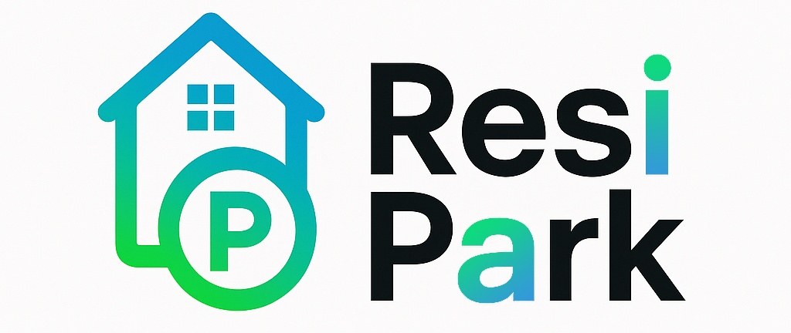
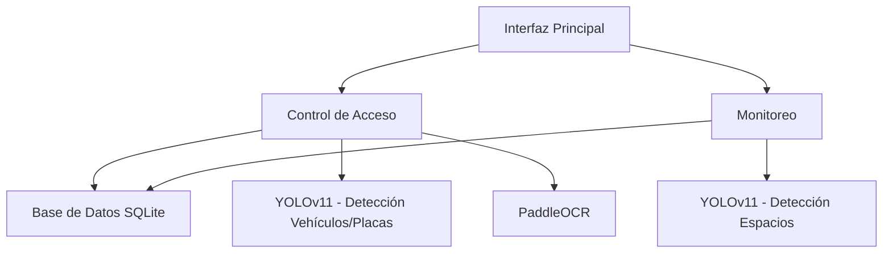

# 🚗 Sistema Integrado de Gestión de Estacionamiento en Tiempo Real

## 📜 Descripción

ResiPark es una solución profesional para la gestión automatizada de estacionamientos que combina visión por computadora con una interfaz unificada. El sistema consta de dos módulos principales integrados en una sola aplicación:

1. **🛂 Módulo de Control de Acceso**
   - Monitorea en tiempo real la entrada de vehículos
   - Detecta automáticamente el tipo de vehículo (Auto, Camioneta)
   - Localiza y recorta la placa del vehículo
   - Implementa OCR para lectura de patentes
   - Verifica autorización en base de datos (Estudiante/Profesor)
   - Asigna espacios disponibles automáticamente

2. **📊 Módulo de Monitoreo de Estacionamiento**
   - Analiza la ocupación de espacios mediante visión por computadora
   - Clasifica cada espacio como Libre/Ocupado/Reservado
   - Visualiza el estado con código de colores intuitivo
   - Proporciona métricas de ocupación en tiempo real

Ambos módulos se comunican mediante una base de datos SQLite centralizada, permitiendo un sistema robusto y desacoplado.

## 🌟 Características Clave

### 🖥️ Interfaz Unificada
- Panel con pestañas para gestión centralizada
- Vista intuitiva del estado del estacionamiento
- Diseño responsive con PyQt5

### 🔍 Tecnologías Avanzadas
- **Detección Dual YOLOv11**: Modelos separados para vehículos/placas y espacios
- **OCR de Alta Precisión**: Implementación de PaddleOCR para lectura de patentes
- **Zonas Configurables**: Área de detección personalizable

### ⚙️ Funcionalidades Inteligentes
- Asignación automática de espacios
- Verificación instantánea de usuarios autorizados
- Actualización en tiempo real del estado de ocupación
- Optimización de recursos (OCR solo en zona de detección)

### 🗃️ Gestión de Datos
- Base de datos SQLite centralizada
- Sistema de señales y slots para comunicación entre módulos
- Registro histórico de accesos

## 🏛️ Arquitectura del Sistema

1. **Pestaña de Control de Acceso**
   - Flujo de trabajo:
     1. Detección de vehículo en zona configurada
     2. Clasificación del tipo de vehículo
     3. Extracción y lectura de patente
     4. Verificación en base de datos
     5. Asignación de espacio disponible

2. **Pestaña de Monitoreo**
   - Procesamiento de imagen/video del estacionamiento
   - Detección del estado de cada espacio
   - Actualización visual y en base de datos
   - Cálculo de métricas de ocupación

## 🚀 Roadmap y Mejoras Futuras

- [ ] Implementar video en tiempo real para monitoreo
- [ ] Sistema automatizado para registro de salidas
- [ ] Módulo de reportes y análisis histórico
- [ ] Integración con sistema de barreras / portones
- [ ] Versión multi-cámara para grandes estacionamientos

## 💻 Requisitos Técnicos

- Python 3.8+
- PyQt5
- OpenCV
- PaddleOCR
- YOLOv11
- SQLite3

## 📄 Licencia

Este proyecto está bajo licencia MIT. 

